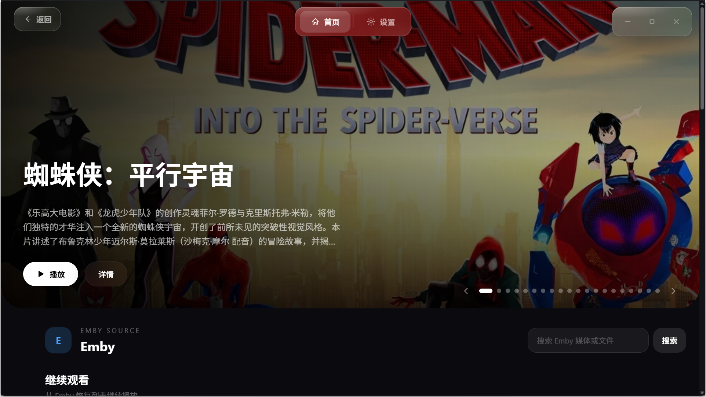
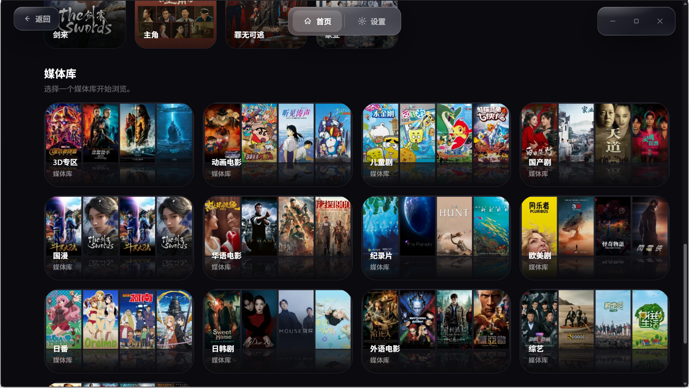
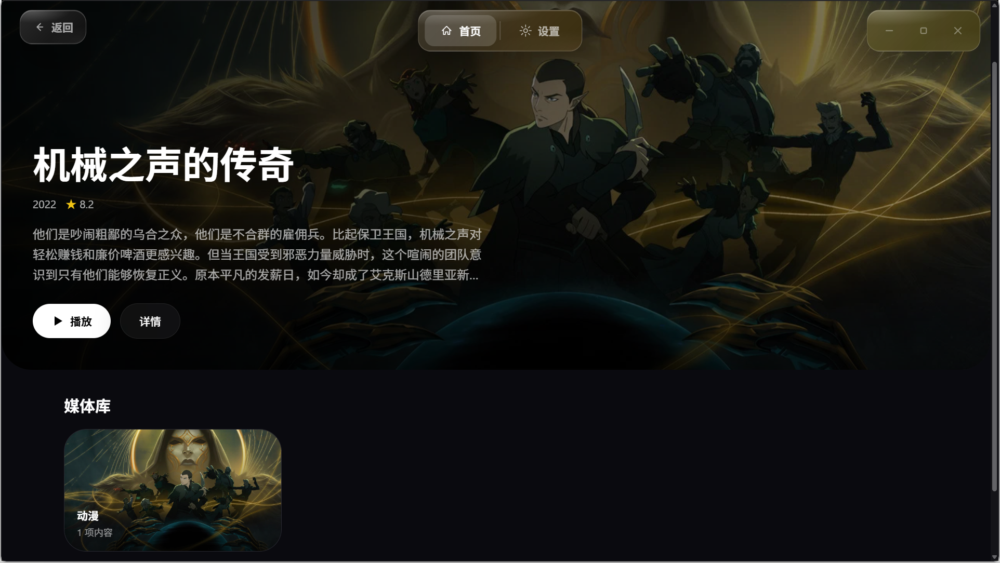
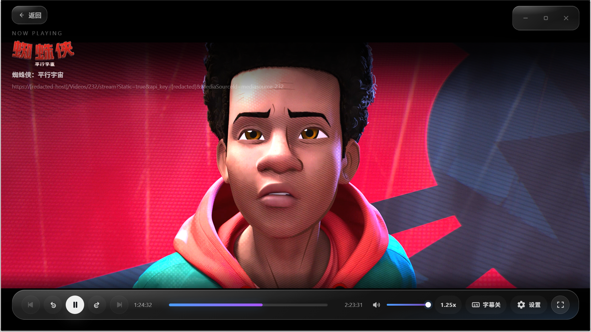

<div align="center">

# OhMyCine Player

**THE NORTH STAR OF YOUR CINEMA**

独立可用的跨平台家庭影院播放器

[](LICENSE)
[](https://github.com/yuanjing-hash/OhMyCine/actions/workflows/player.yml)

</div>

## 这是哪个仓库

本仓库只包含 OhMyCine Player。Player 基于 Tauri v2、Vue 3、TypeScript、Rust 和 libmpv，可以独立连接本地文件、Emby/Jellyfin、OpenList/Alist、CloudDrive2、WebDAV 等数据源；连接 OhMyCine Server 只会增加发现、下载、追更和媒体库同步能力，不影响基本播放。

OhMyCine 生态已经拆分为：

- [OhMyCine](https://github.com/yuanjing-hash/OhMyCine)：Player（当前仓库）
- [OhMyCine-Server](https://github.com/yuanjing-hash/OhMyCine-Server)：Server 与 `omc` CLI
- [OhMyCine-Plugins](https://github.com/yuanjing-hash/OhMyCine-Plugins)：官方插件、Plugin SDK、Registry 与 Hub

## 当前能力

- Cinema OS 风格首页、海报墙、媒体详情、分季分集和沉浸式播放界面。
- 本地文件、Emby/Jellyfin、OpenList/Alist、CloudDrive2、WebDAV、123 云盘和夸克数据源。
- Player 本地只读刮削、TMDB 元数据、分类、未识别兜底和海报缓存，不写回原始数据源。
- Windows libmpv 播放、字幕/音轨、弹幕、播放进度、收藏、下载与离线媒体。
- Windows 标准安装、标准免安装 ZIP、portable ZIP 和签名自动更新。
- Android ARM64 预览构建与原生 `SurfaceView` libmpv 播放链路。

## 截图

| 聚合首页 | 媒体主页 |
|----------|----------|
|  |  |
| Emby 媒体库 | OpenList/Alist 自动刮削 |
|  |  |
| 播放页面 | |
|  | |

## 本地开发

Windows 原生环境是桌面开发与验证的权威环境：

```powershell
git clone https://github.com/yuanjing-hash/OhMyCine.git
cd OhMyCine
npm install
npm run setup:libmpv -- windows
npm run tauri:dev:windows
```

常规门禁：

```powershell
npm run typecheck
npm run lint
npm run build
cargo check --manifest-path src-tauri/Cargo.toml
```

不要为了测试清空真实标准或 portable 配置。需要干净状态时使用隔离临时 profile。

## 目录

```text
src/                 Vue 3 前端
src-tauri/           Rust/Tauri 与 libmpv 集成
scripts/             构建和契约验证脚本
docs/architecture/   Player 架构与安全文档
.github/workflows/   Player CI 与发布
```

详细开发规则见 [DEVELOPMENT.md](DEVELOPMENT.md)，Player 架构见 [docs/architecture/03-player-design.md](docs/architecture/03-player-design.md)。

## 许可证

[GPL-3.0](LICENSE)
